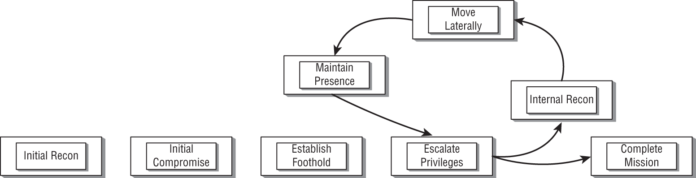

# Attack Life Cycle

- **Initial Recon**: identifies a victim and potential attack possibilities.
- **Initial Compromise**: gain access, commonly would be phishing attacks.
- **Establish foothold**: after compomising a system, the attacker retain access to the system so they can get back in when they need to.
- **Escalate privileges**: purpose is having administrative privileges.
	- Gathering credentials from memory or disk.
- **Internal Recon**: investigate connections the system is known to have had with other systems in the network. May be trying to identify other credentials that are known to the syste.
- **Move Laterally**: move around the system.
- **Maintain Presence**: keep the malware running so the attacker can keep getting back in when they want.
- **Complete Mission**: the attacker doesn't just visit the victim's system in one time. There would be numerous times, to get data as much as possible.

[Back to Chapter 1: Ethical Hacking](../ceh.md#chapter-1-ethical-hacking)