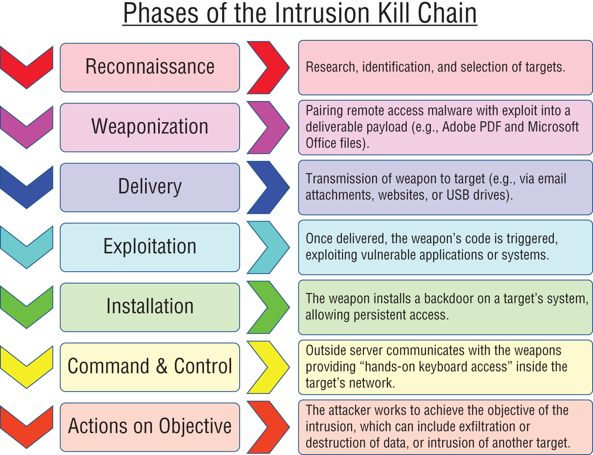

# Cyber Kill Chain

- **Reconnaissance**: 
	- Identifies the target.
	- Potential points of attack.
	- Identify vulnerbilities that could be exploited.
- **Weaponization**: determine how to attack the target.
	- May create a custom piece of malware.
	- May use a piece of common off-the-shelf (COTS) malware.
- **Delivery**: how you get the weapon into the victim's environment.
- **Exploitation**: when the malicious software infects the victim's system.
- **Installation**: install additional software to maintain access to the system and perhaps give themselves remote access to the system.
- **Command & Control**: give attackers remote access to the infected system.
- **Actions on Objective**: achieve the objectives.

[Back to Chapter 1: Ethical Hacking](../ceh.md#chapter%201%20ethical%20hacking)