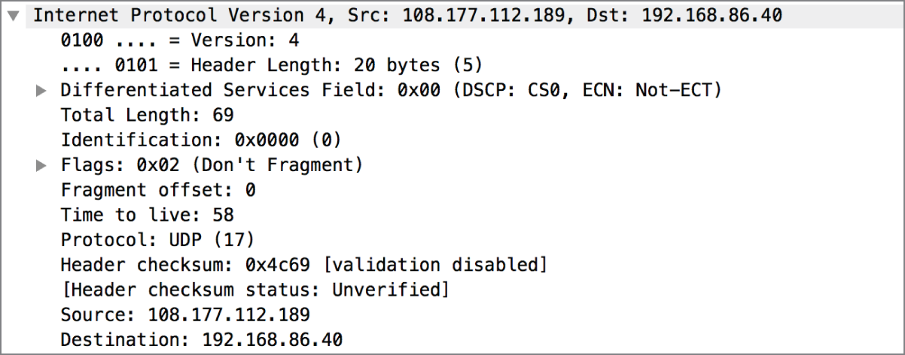
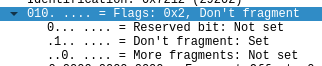

# IP in network
- Is in Network layer.
- As each layer is passed through, a set of data is added to the message that is specific to the protocol processing the message -> *headers*
- The PDU of IP is called a *packet*.
- Two versions of IP: *IPv4* and *IPv6*.
## Headers

- **Version**: indicates which version of IPv4 is in this packet. 4-bit field.
- **Header Length**: indicates how many words are in the IPv4 header. The header is based on 32-bit words ~ 4 bytes. In the example: `0101` == 5 words == 20 bytes.
- **Type of Service**: ToS field ~ Differentiated Services Field. Helps network elements make quality of service (QoS) decisions by prioritizing some messages and deprioritizing others. 8-bit (1-byte) fiels.
- **Total Length**: total length of the message, including the IPv4 header and any subsequent data, not include any header that gets added on after the fact (layer 2 header). 2 bytes long -> allow total message length of `65,535` octets.
- **Identification**: When the data is larger than maxium length allowed based on the size of the length field, the message need to be fragmented. All fragments will have the same identification here.
- **Flags**: 3 bits
	- 
	- First bit (RB): reserved. Always set to 0. Reserved for future use.
	- Second bit (DF bit): 1 == don't fragment the message.
	- Third bit (MF): 1 == more fragements later. 0 == this message is the last fragment.
- **Fragment Offset**: 13 bits long. Indicated where the data in the packet aligns.
- **Time to Live** (TTL): unit: seconds. 8 bits long.
	- Initial definition: the time that a message can live on the network before it is considered to be expired.
	- Reality: indicates the number of network devices (routing devices, essentially) the message can pass through.
- **Protocol**: indicates the next protocol. 8-bit field. Tell the receiving system what headers to look for in the transport header.
- **Checksum**: 16bit value. Used to determine whether the header is intact.
- **Source Address**: IPv4 address that sent the message. 4 octets in length.
- **Destination Address**: IPv4 address that the message is going to. 4 octets in length.

## Addressing
### IPv4
- IPv4 addresses: 4 octets long. (dotted quads, dotted decimal notation).
- 127.0.0.0 - 127.255.255.255: reserved for loopback addresses. Allow for testing over a network without sending any traffic outside the system. Commonly 127.0.0.1
- Private addresses:
	- 10.0.0.0-10.255.255.255
	- 172.16.0.0-172.31.255.255
	- 192.168.0.0-192.168.255.255
- 224.0.0.0-239.255.255.255: for multicast messages.

### IPv6
- IPv6 addresses: use 16 bytes.
- Ex: `fe80:0000:0000:0000:62e3:5ec3:3e06:daa2`
- Short form: `fe80::62e3:5ec3:3e06:daa2`
## Subnets
- The subnet mask is 32 bits in length.
- Represented as a dotted quad in an IPv4 address.
- Portion of an IP address belongs to the network: bit 1.
- Subnet masks can have only the certain values:
	- 0 = `00000000` (8 digits)
	- 128 = `10000000`
	- 192 = `11000000`
	- 224 = `11100000`
	- 240 = `11110000`
	- 248 = `11111000`
	- 252 = `11111100`
	- 254 = `11111110`
	- 255 = `11111111`
- Example:
	- subnet mask: 255.255.255.128
	- There are 2 ranges: 0-127 and 128-255
	- My IP is: 172.20.30.42 -> My range is 172.20.30.0-172.20.30.127.
- Another way of desinating network blocks is using Classless Inter-Domain Routing (CIDR) notation.
- Example: `172.20.30.42/25`
- `25` means 25 bit 1. Number of available host: `2^(32-25)=128`
- The lowest possible address is used for the network.
- The highest possible address is used for the broadcast address.

[Back to Chapter 2: Network Foundations](../ceh.md#chapter-2-network-foundations)