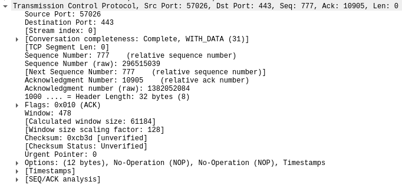
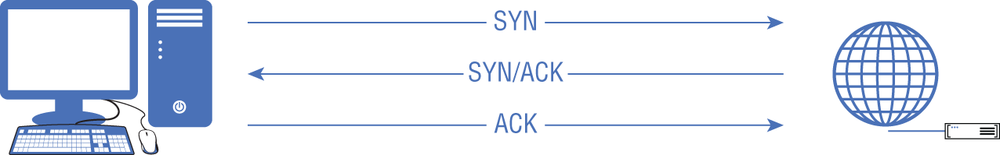

# TCP

- The PDU for TCP is called a segment.
- About getting messages to the applications.
- Use ports as a way of addressing applications.

- TCP headers:
	- **Source Port**: 16 bits in length.
	- **Destination Port**: 16 bits in length.
	- **Sequence Number**: 32-bit number, 
		- is set to a random value when the conversation is initiated.
		- is incremented with the number of bytes that are sent.
		- is set by sender.
	- **Acknowledgment Number**:
		- is set from the recipient.
		- The acknowledgment number is set to the next byte number the recipient expects to receive.
	- **Data Offset**: 4-bit value indicating the number of 32-bit words in the TCP header.
	- **Reserved**: 6 bits in the TCP header that are reserved for future use.
	- **Control Bits**: 6 flag bits that are used to indicate disposition of the message.
		- *SYN* flag: the synchronize flag, the sequence number is set and should be recorded.
		- *ACK* flag: the acknowledgment flag.
		- *URG* flag: the urgent pointer has data that is significant.
		- *PSH* flag: the data should be pushed up rather than being buffered.
		- *RST* flag: resets the connection, may happen if a message is received that appears to be in error.
		- *FIN* flag: the conversation is over and there is no more data to send.
	- **Window**: tell the recipient how many bytes the sender is willing to accept. 16-bits
		- Smaller window size: more acknwledgments are necessary, communication channel isn't reliable.
		- Larger window size: the channel is reliable, there isn't as much need to keep checking in.
	- **Checksum**: 16-bit field, used to ensure that the communication hasn't been corrupted.
	- **Urgent Pointer**: 16-bit urgent pointer indicates the next byte value after the urgent data.
	- **Options**: 
- **Three-way handshake**:
	- Ensure that both sides of the  conversation are live and active because they are expected to respond.
	- 
- Most applications rely on messages that are presented in the correct order -> use TCP.

[Back to Chapter 2: Network Foundations](../ceh.md#chapter%202%20network%20foundations)