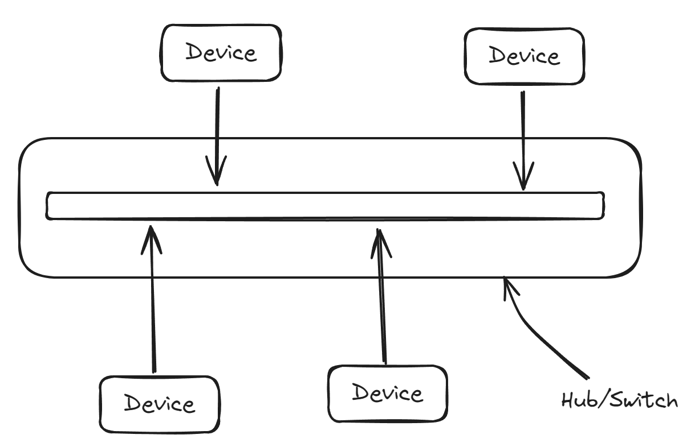
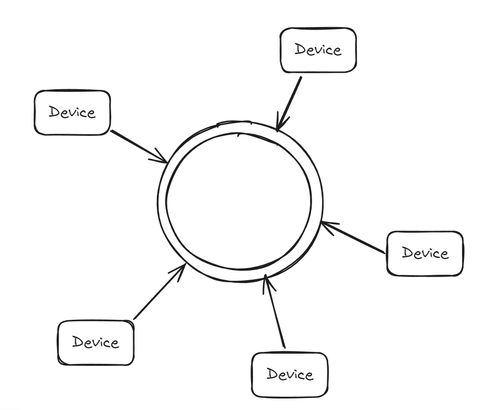
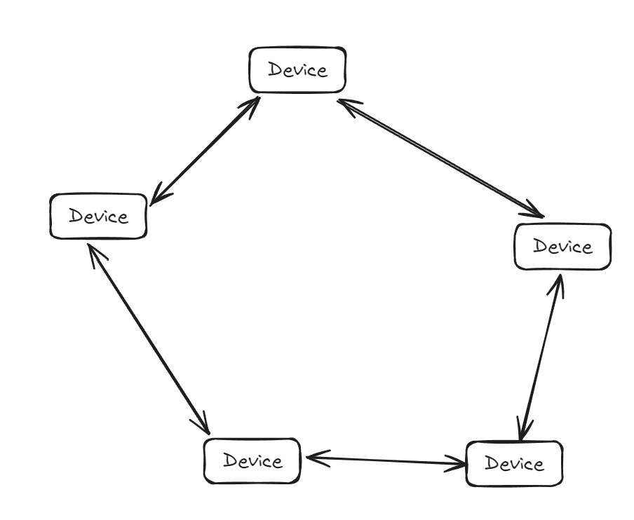
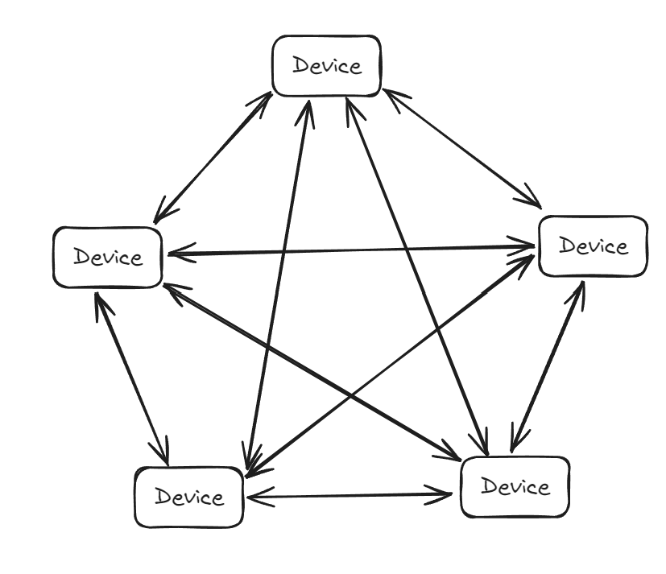

# Topologies

- The topology tells you how traffic flows from one system to another and what intermediary devices the communication passes through, which will help you determine where may be able to intercept or manipulate traffic.
- **Bus Network**:
    - 
	- Terminators: keep the signal from reflecting back onto wire, causing cancellation of the signal.
	- There is no mediating device.
	- All of the computers are connected directly to one another by means of that single network cable.
- **Star Network**:
	- There is a mediating device between all the devices.
	- Old network: hub. Modern: switch.
    - 
	- If using hub == bus network.
		- Every device will get the signals.
	- If using switch:
		- Uses the MAC address to make decisions about where traffic goes.
- **Ring Network**:
    - 
	- **Token ring network** is a popular type of Ring Network.
		- Using multistation access units  (MAUs).
		- Don't behave like Star Network.
		- Using a talking stick == token.
		- Behaving like a bus network but no need *terminaltor*.
- **Mesh Network**:
	- System are wired directly to one another.
    - 
	- Peer-to-peer.
	- Full mesh network: 
        - 
		- It's complexity.
- **Hybrid**:
	- Common hybrid approach: star-bus.

[Back to Chapter 2: Network Foundations](../ceh.md#chapter%202%20network%20foundations)