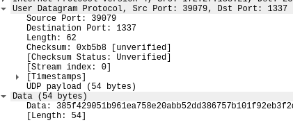

# UDP

- a much lighter‐weight protocol that offers no guarantee of delivery.
- 
- Headers:
	- Source *port*
	- Destination *port*
	- Checksum
	- Length
- Closed ports are not mentioned in UDP.
- Working with UDP ports is entirely unreliable.
- If you don't get a response:
	- lost or dropped packet.
	- the application ignored the message.
	- no response required.
- UDP is good for applications that require fast setup and transmission.
- The PDU for UDP is datagram.
- Real-time protocols are less concerned about the correct order -> use UDP.

[Back to Chapter 2: Network Foundations](../ceh.md#chapter-2-network-foundations)